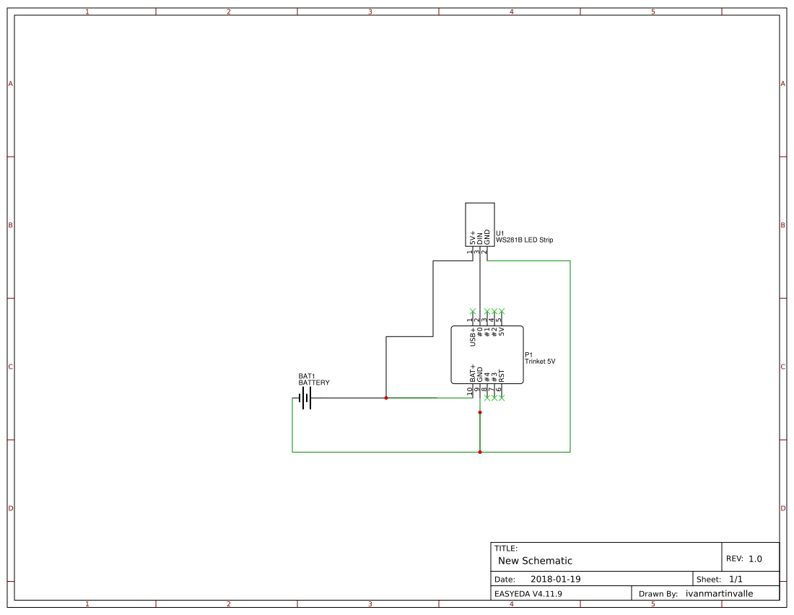
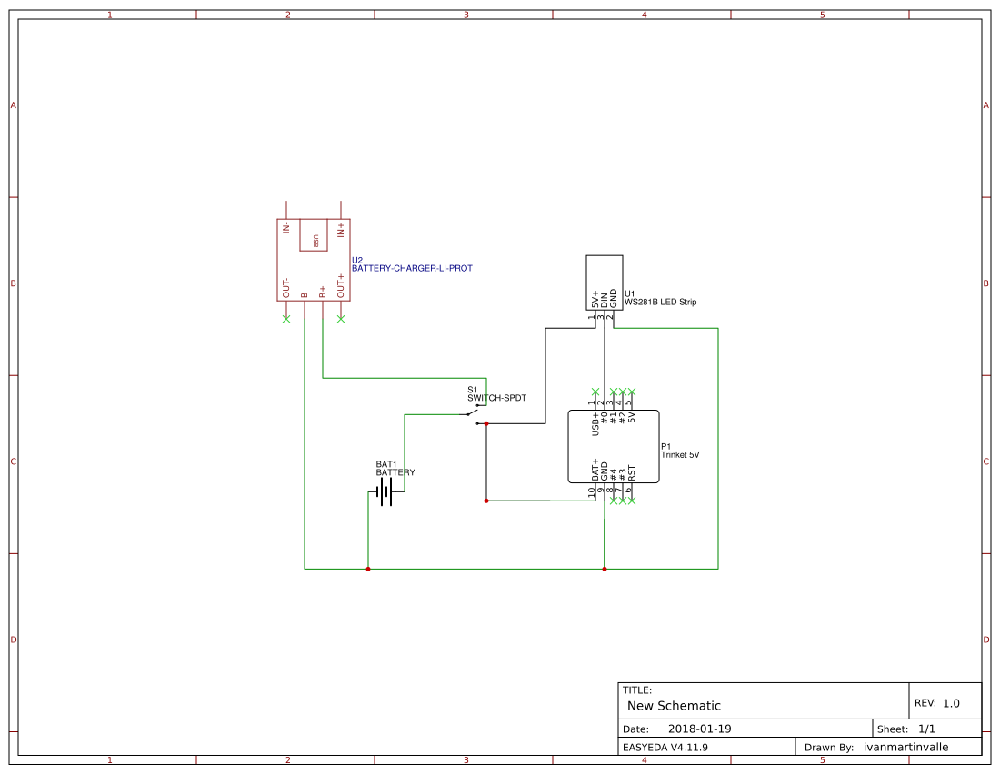

# LED Hula Hoop

LED Hula Hoop. Supports simple algorithm-based patterns, as well as (some) Hyperion patterns. Note: I haven't looked at this in forever, and prioritized it working over cleanliness, so yeah...

## Contents
- `./src/BMP`: console program to convert BMP images to the bit array required to hardcode Hyperion patterns into the hoop. This also served as a way to debug the arduino code as the C# is almost copy-pastable to C++.
- `./src/hoop`: arduino program that powers the hoop

## Usage
```sh
cd src/BMP
dotnet run -- hello 4
```

- the above converts an image called `./patterns/hello.bmp` to a pattern, with a magic number of 4 that determines how much to compress colors for smaller pattern sizes
- `./patterns` needs to contain BMP images. Hyperion images can be found [here](https://www.hyperionhoop.com/shop/mtsp.php?paID=18). You'll have the best of luck with small images with few colors.

## Schematics


This schematic has a JST connection for charging.


This schematic has a Micro-USB connection for charging.

Optionally, one can wire a button to `BUTTON_PIN` on the trinket (currently pin 2) to manually change patterns. By default, the hoop runs some patterns in a loop.

### Electronics
- [Adafruit Trinket](https://www.adafruit.com/product/1501)
- [LEDs](https://www.amazon.com/dp/B00ZHB9M6A)
- [battery](https://www.adafruit.com/product/1781)
- [JST charger](https://www.adafruit.com/product/1304)
- [USB charger](https://www.amazon.com/dp/B06XCXPY86)
